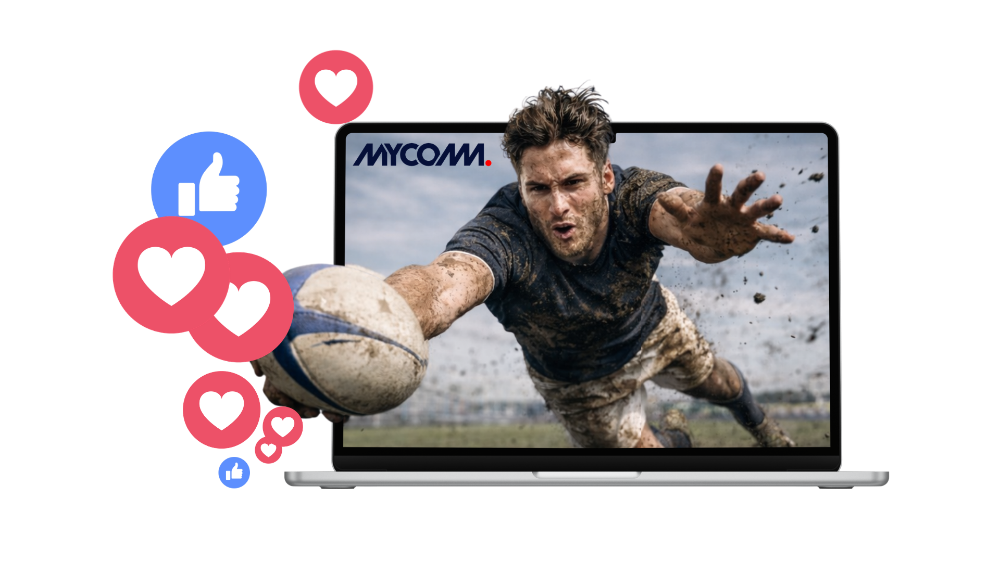
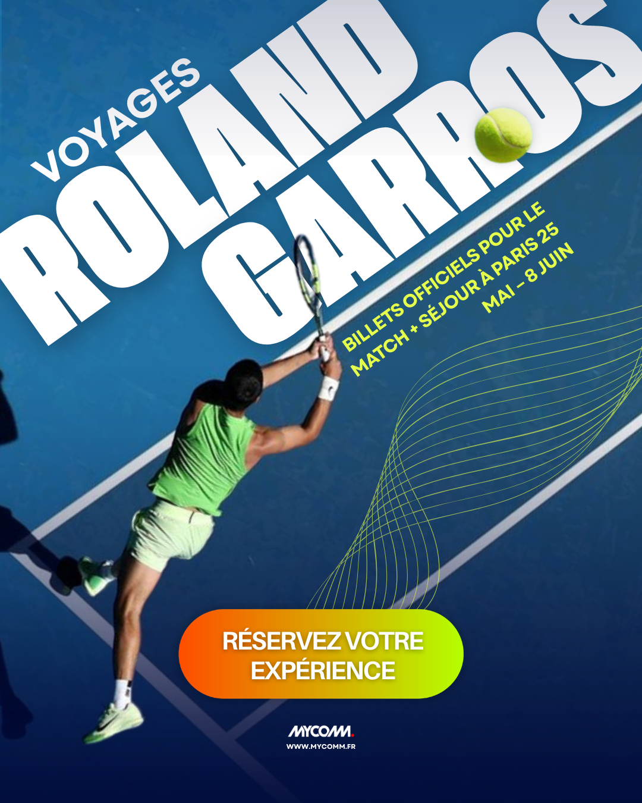
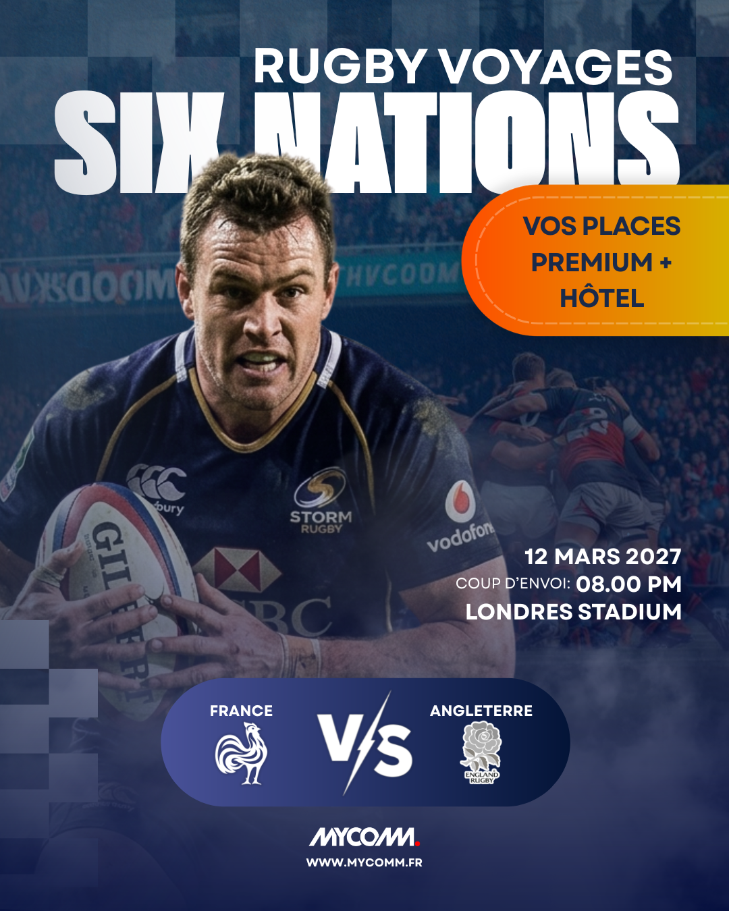
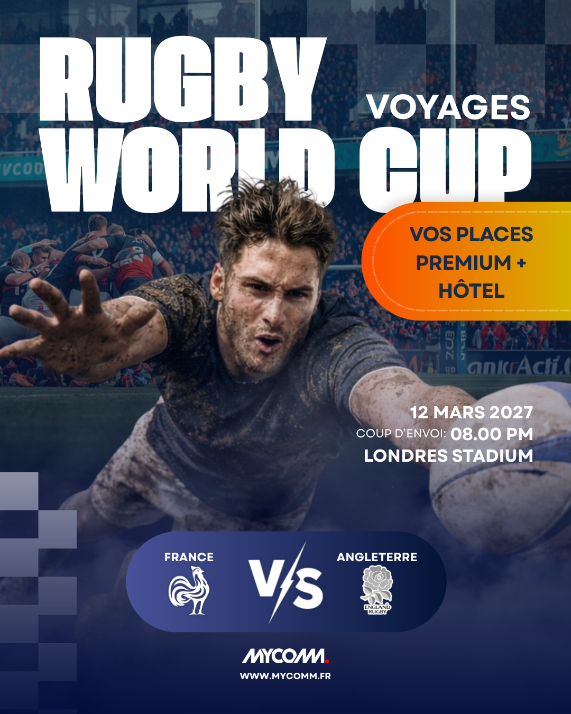

# MYCOMM Digital Acquisition Strategy

Digital marketing strategy case study for **MYCOMM**, a sports-event travel agency offering all-inclusive packages for major international events.

**Goal:**
Develop a scalable **digital acquisition strategy** to increase visibility, qualified traffic, and online conversions.

**Work:**

- Market & competitor analysis  
- Customer personas and journey mapping  
- SEO audit (technical, semantic, performance)  
- SEA campaign structure (Google Ads strategy)  
- Social media acquisition concepts  
- KPI framework for performance tracking  

**Outcome:**
A structured acquisition framework combining **SEO growth, paid search campaigns, and persona-driven targeting** to support MYCOMM’s expansion in the sports travel market. 

**Campaign Concepts:**

Example social media creatives designed to illustrate the proposed campaign strategy.

  

    <strong>IG – Tennis 1</strong> 
    
  

  

    <strong>IG – Tennis 2</strong> 
    
  

  

    <strong>FB – Rugby 1</strong> 
    
  

  

    <strong>FB – Rugby 2</strong> 
    
  

**Project Assets:**

- [Strategy Report (PDF)](report.pdf)  
- [Executive Presentation (Slides)](presentation.pdf)  

**Authors:** Elise Devaux, Valeriia Homeniuk, Liliia Rastorhuieva
